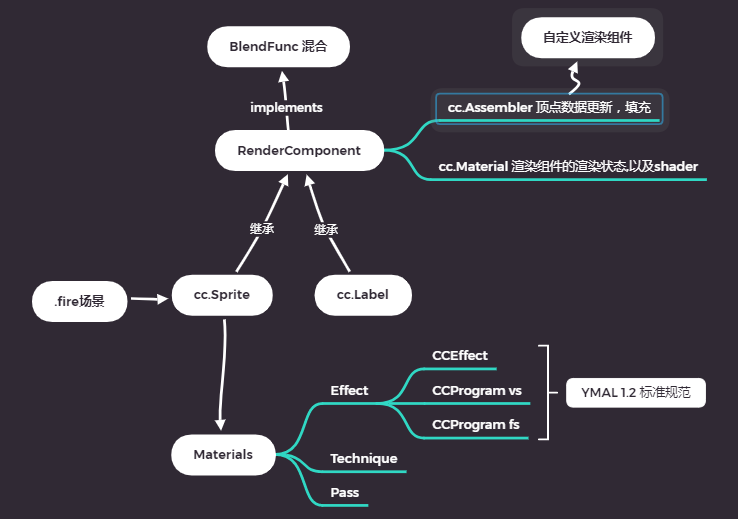

#### 顶点shader

- 模型的顶点：大小是相对于局部的坐标；
- 将模型的局部坐标-> 根据节点的位置 旋转 缩放-> 装换到游戏世界的世界坐标里
  **影响模型效果的，还有摄像机**
  将世界坐标，转换到以摄像机为原点坐标系下的坐标
  物体局部坐标->游戏世界坐标->摄像机透视坐标下

 

####  片元Shader：

给每个三角形涂色  
编写代码,在上色的时候做干预,就可以生成的不同的绘制物体的效果

渲染流程的解析路径：[渲染流程深入剖析笔记](https://www.pianshen.com/article/86101085769/)

