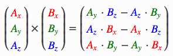

### 向量

**点乘**两个向量的点乘等于它们的数乘结果乘以两个向量之间夹角的余弦值v¯⋅k¯=||v¯||⋅||k¯||⋅cosθ

**向量相乘**（向量之间的相乘不符合交换律，前一个的列数必须和后一个向量的行数相同）

**叉乘**（向量积，外积，叉积）向量积可以被定义为：

模长：（在这里θ表示两向量之间的夹角（共起点的前提下）（0°≤θ≤180°），它位于这两个矢量所定义的平面上。）

方向：a向量与b向量的向量积的方向与这两个向量所在平面垂直，且遵守右手定则。（一个简单的确定满足“右手定则”的结果向量的方向的方法是这样的：若坐标系是满足右手定则的，当右手的四指从**a**以不超过180度的转角转向**b**时，竖起的大拇指指向是**c**的方向。）

